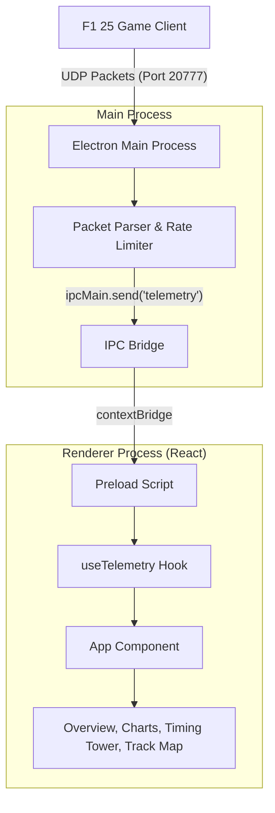

# Track N Race 🏎️

**Track N Race** is a modern, standalone, real-time telemetry dashboard designed for **EA Sports F1 25**. Built using **Electron, React, and TypeScript**, it binds directly to the game's high-frequency UDP telemetry stream, giving you live race engineering insights right on your desktop—with no heavy virtual machines, Docker stacks, or external databases required.

---

## 🚀 Key Features

* **🏎️ Real-Time Overview:** Instantly track critical metrics like Speed, RPM, Gear, Throttle/Brake percentages, DRS, ERS charge, and live Tyre Compound ages.
* **📈 Input & Steering Charts:** High-frequency visualizers for throttle-brake overlaps, steering inputs, and gear charts to help you diagnose pace loss and lockups.
* **⚡ Power & ERS Breakdown:** Monitor your battery harvest and deployment history, total power splits (ICE vs. MGU-K), and fuel lap deltas.
* **🌡️ Thermal & Tyre Panels:** Live grid and graphical monitors tracking tyre surface temperatures, inner carcass temperatures, and brake thermals.
* **🏁 Session Panel & Live Track Map:** Full track map tracking driver dots, real-time marshaling zones, race event notifications, leaderboards, and weather forecasts.
* **🎨 Customizable Grid:** Fully modular layout. Toggle and organize dashboard widgets directly in the app to suit your secondary screen.
* **🌓 Curated Themes:** Harmonious premium dark and light modes with glassmorphic visuals and subtle micro-animations.

---

## 🛠️ Architecture & Data Flow



1. **UDP Socket Receiver (`src/main/udpReceiver.ts`):** The Electron main process spawns a native Node.js `dgram` UDP socket listening on port `20777` (default).
2. **Telemetry Parser (`src/main/packetParsers.ts`):** High-frequency binary buffers are parsed into lightweight TypeScript structures and throttled to ensure zero rendering overhead.
3. **Secure IPC Bridge (`src/preload/index.ts`):** Decoded telemetry frames are securely pushed from the main process to renderer windows using Electron's `contextBridge`.
4. **React Custom Hook (`src/renderer/src/hooks/useTelemetry.ts`):** Manages historical sliding windows, maps driver metadata, tracks session states, and feeds state into rendering components.

---

## 📦 Getting Started

### Prerequisites

* [Node.js](https://nodejs.org/) (v18 or higher recommended)
* [npm](https://www.npmjs.com/) (installed with Node)

### Installation & Run

1. Clone the repository and navigate to the Electron application folder:
   ```bash
   cd telemetry-electron
   ```

2. Install all dependencies:
   ```bash
   npm install
   ```

3. Start the application in development mode:
   ```bash
   npm run dev
   ```

### 🎮 Configure the F1 25 Game

1. Launch **F1 25** and navigate to **Game Options > Settings > Telemetry Settings**.
2. Set **Telemetry** to **On**.
3. Set **IP Address** to your computer's local IP (or `127.0.0.1` if running on the same machine).
4. Set **Port** to `20777`.
5. Set **Format** to `2025` (or whichever latest version is selected).
6. Set **Rate** to **60Hz** (recommended) or **30Hz** for optimal visual resolution.

---

## 🏗️ Production Packaging

To compile the application and bundle it into a standalone Windows installer (NSIS):

```bash
# Compile and build asset bundles
npm run build

# Package the installer locally
npm run pack
```

The resulting installer (`Track N Race Setup 1.0.0.exe`) will be generated inside the `telemetry-electron/dist/` directory.

---

## 📝 License

Distributed under the MIT License. See `LICENSE` for more information.