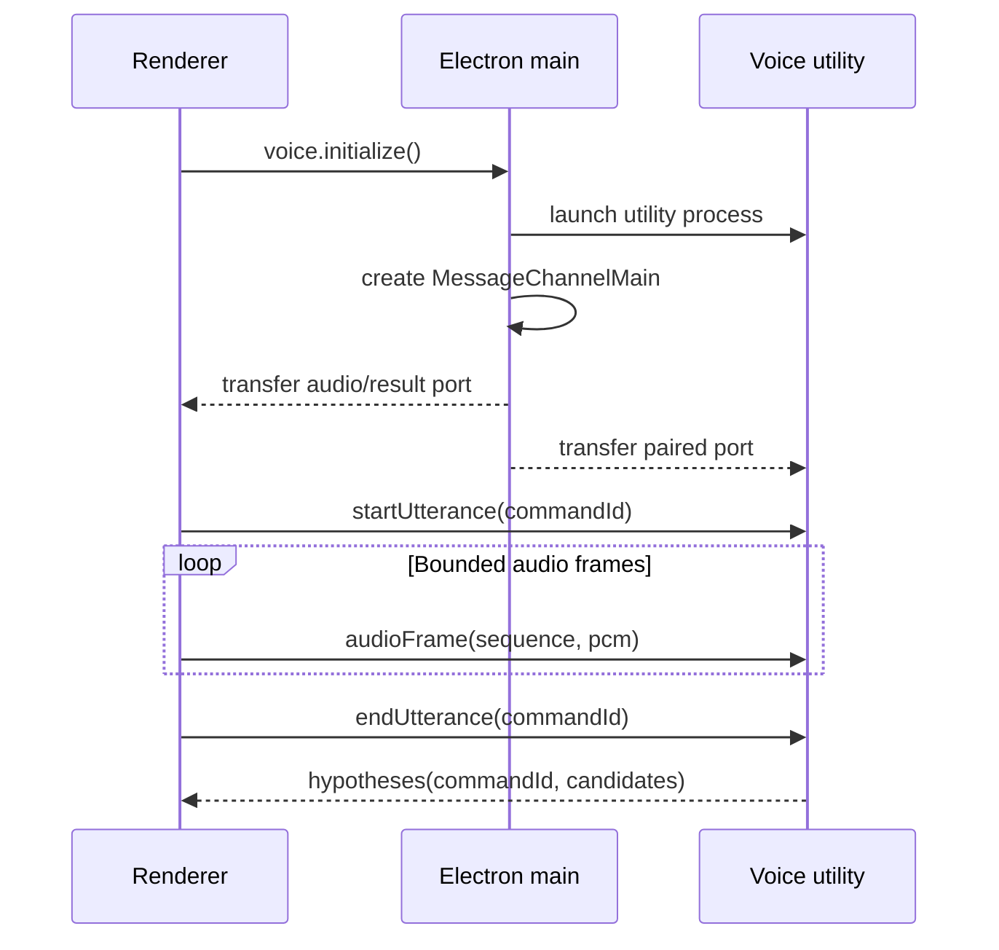
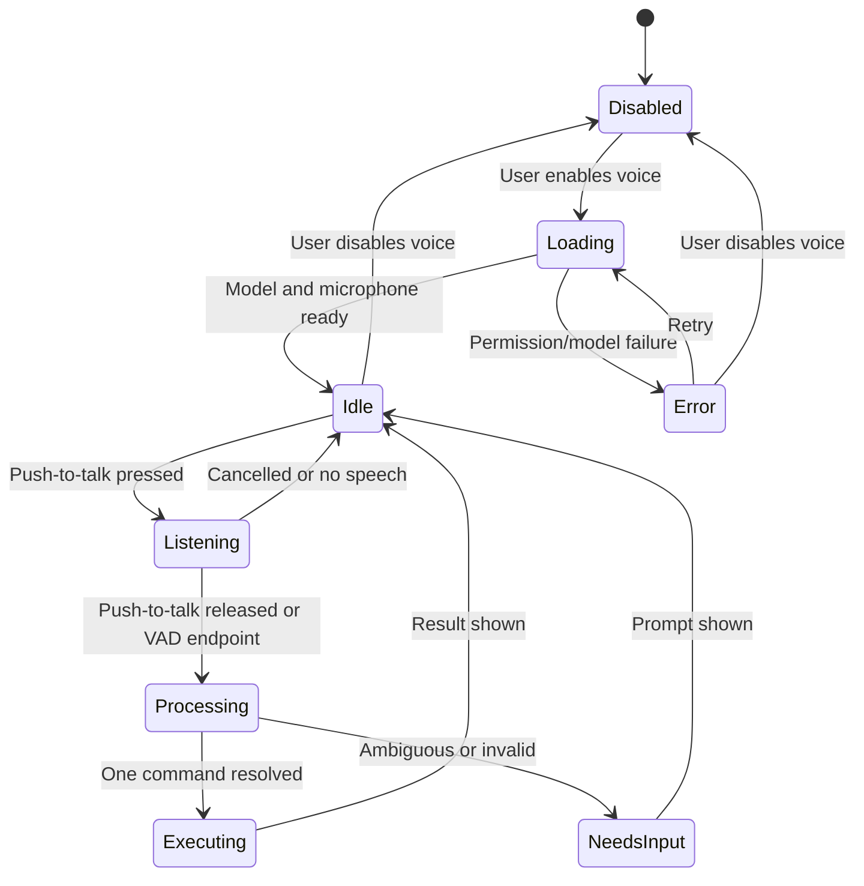
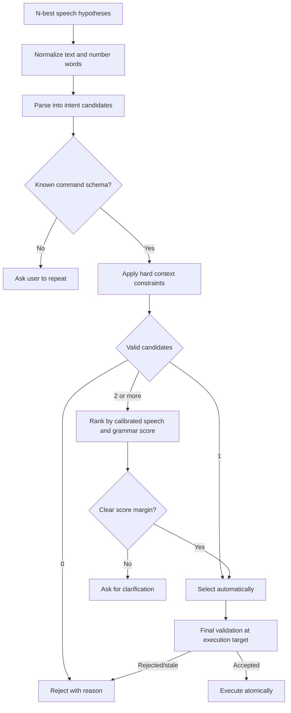
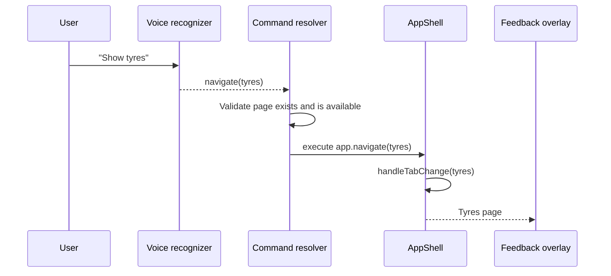
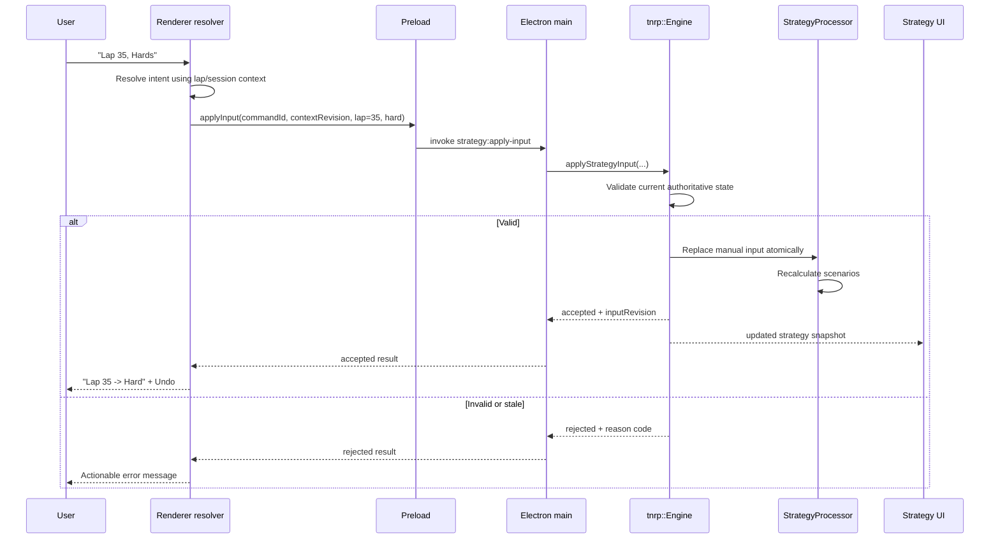

# On-Device Voice Command System Design

Status: Proposed  
Last updated: 2026-09-01  
Scope: Electron application voice input, page navigation, strategy what-if inputs,
shared strategy-engine integration, offline inference, privacy, testing, and rollout

## 1. Purpose

This document defines a future on-device voice command system for Track N Race.
The system is intentionally narrow: it is an additional input method for known
application actions, not a conversational assistant and not a general-purpose
speech-to-text feature.

The first two product capabilities are:

1. Switch between application pages.
2. Change strategy scenario values, beginning with commands such as
   `Lap 35, Hards`, then recalculate and display the projected gain or loss.

The design must make those operations fast enough to use while driving, keep all
audio and inference on the user's device, avoid false actions, and have no
measurable effect on telemetry ingest or chart rendering.

The central design principle is:

> Voice recognition proposes a typed command. Track N Race validates and executes
> that command through the same domain APIs used by mouse and keyboard input.

Voice must never simulate clicks, inspect rendered text to find controls, execute
arbitrary strings, or contain strategy arithmetic.

## 2. Product definition

The feature is a small, context-aware command language optimized for racing.
Users should be able to issue short phrases without learning rigid computer-like
syntax, while the application uses known session state to reject impossible
interpretations.

Representative interactions:

| Spoken phrase | Typed intent | Result |
|---|---|---|
| `Show strategy` | `navigate(strategy)` | Switch to the Strategy page |
| `Tyres page` | `navigate(tyres)` | Switch to the Tyres page |
| `Lap thirty-five, hards` | `strategy.setPitStop(35, hard)` | Apply a hypothetical stop and recalculate |
| `Lap fifty, mediums` | `strategy.setPitStop(50, medium)` | Apply a hypothetical stop and recalculate |
| `Clear the planned stop` | `strategy.clearPitStop()` | Remove the manual scenario input |

The result of a strategy command is a hypothetical plan input. It does not alter
the game, send game controls, or claim that the user has actually pitted.

## 3. Goals

### 3.1 Product goals

- Make common page changes possible without reaching for the mouse.
- Make multi-field strategy input faster than operating several UI controls.
- Support terse natural variants without supporting unrestricted conversation.
- Use live session facts to resolve recognition ambiguity when only one result is
  possible.
- Show exactly what was understood and provide immediate undo for mutations.
- Keep microphone use explicit, visible, optional, and fully local.
- Leave room for additional strategy input fields without redesigning the audio
  pipeline.

### 3.2 Correctness goals

- Never execute a command outside the typed command allowlist.
- Never silently coerce an impossible strategy value to the nearest valid value.
- Apply multi-field strategy changes atomically.
- Validate strategy mutations against authoritative engine state immediately
  before applying them.
- Treat live, playback, seek, flashback, and session reset as explicit contexts.
- Preserve the shared C++ strategy engine as the only owner of strategy
  calculations.
- Make repeated delivery of one recognition result idempotent.

### 3.3 Performance goals

- Keep model loading and inference out of the renderer and Electron main-process
  hot paths.
- Do not route continuous audio through ordinary `ipcRenderer.send` calls.
- Bound every audio queue so a slow recognizer cannot cause unbounded memory use.
- Load the model only when voice control is enabled.
- Shut the voice worker down cleanly when disabled or when the application exits.
- Cause no statistically significant regression in chart frame time, renderer
  long tasks, UDP processing, or playback delivery.

## 4. Non-goals

The initial design does not include:

- a general conversational assistant;
- an LLM or natural-language planning agent;
- cloud speech recognition;
- dictation or transcript storage;
- voice authentication or speaker identification;
- control of the F1 game itself;
- arbitrary UI automation;
- voice-generated strategy arithmetic in TypeScript;
- training a speech model from scratch before an off-the-shelf baseline exists;
- always-listening activation in the first release;
- guaranteed recognition of arbitrary names, accents, or languages;
- automatic installation of an unverified model downloaded at runtime.

## 5. Existing architecture and integration boundary

Track N Race currently has two relevant ownership boundaries.

### 5.1 Renderer-owned application state

`electron-frontend/src/renderer/src/app/AppShell.tsx` owns the active `Tab` and
the animated `handleTabChange()` transition. The valid pages are declared by the
`Tab` union and `TAB_OPTIONS` in
`electron-frontend/src/renderer/src/app/appConfig.ts`.

Page switching is therefore a renderer command. It does not belong in the
telemetry engine or Electron main process.

### 5.2 Shared strategy state

The strategy calculation lives in `protocol_parser_library` and is exposed to
Electron through the N-API addon, main process, preload bridge, and renderer.
The existing required-stop input follows this path:

```text
StrategyPanel
    -> window.strategyBridge.setMinimumStops(...)
    -> Electron IPC
    -> bridgeManager
    -> N-API Engine.setStrategyMinimumStops(...)
    -> tnrp::Engine
    -> StrategyProcessor
    -> updated strategy snapshot
```

Any future `Lap 35, Hards` input must end in the same shared C++ strategy domain.
The renderer may parse and resolve speech, but it must not calculate gains,
losses, tyre life, legality, or projected position.

### 5.3 Explicit ownership table

| Responsibility | Owner |
|---|---|
| Microphone capture | Electron renderer audio module |
| Audio resampling and framing | Renderer `AudioWorklet` |
| Voice activity detection | Voice utility process |
| Speech/keyword inference | Voice utility process |
| Transcript normalization | Renderer voice command module |
| Grammar parsing | Renderer voice command module |
| Contextual candidate resolution | Renderer command resolver |
| Final strategy validation | Shared C++ strategy engine |
| Strategy gain/loss calculation | Shared C++ strategy engine |
| Page transition | `AppShell` command handler |
| User feedback and undo | Renderer command UI |
| Permission enforcement | Electron main process and operating system |
| Voice preferences | Electron configuration store |

## 6. Target architecture

```mermaid
flowchart LR
    MIC[Microphone] --> AW[Renderer AudioWorklet]
    AW -->|16 kHz mono PCM over MessagePort| VP[Voice utility process]
    VP --> VAD[Voice activity detection]
    VAD --> ASR[Constrained on-device recognizer]
    ASR -->|N-best hypotheses| IP[Intent parser]
    IP --> CR[Contextual resolver]
    CR --> REG[Typed command registry]

    REG -->|Navigation command| APP[AppShell]
    APP --> PAGE[Page transition]

    REG -->|Strategy mutation| PRE[Preload strategy bridge]
    PRE --> MAIN[Electron main]
    MAIN --> NAPI[N-API addon]
    NAPI --> ENG[tnrp::Engine]
    ENG --> SP[StrategyProcessor]
    SP --> SNAP[Strategy snapshot]
    SNAP --> UI[Strategy UI and feedback overlay]
```



The Electron main process is the control plane. It creates and supervises the
utility process, enforces microphone permission policy, and establishes message
ports. It must not receive or process every audio frame itself.

### 6.1 Process isolation

Inference must run in a dedicated Electron utility process or an equivalently
isolated native child process. It must not run:

- in the renderer, where it could stall React and chart rendering;
- on the Electron main thread, where it could delay IPC and window events;
- on the libtnrp UDP receive thread;
- on the libtnrp playback thread;
- inside a chart animation loop.

If the selected inference library requires a native addon, that addon belongs to
the voice utility process. It should not be added to the existing telemetry N-API
addon unless later evidence proves that a shared binary is materially simpler
without compromising isolation.

### 6.2 Audio transport

The renderer captures the selected microphone through Web Audio. An
`AudioWorkletProcessor` converts input to the recognizer's required form, expected
to be signed or floating-point mono PCM at 16 kHz.

Audio frames travel over a dedicated transferable `MessagePort`, not the normal
preload API. The channel has the following properties:

- fixed-duration frames;
- a bounded queue;
- sequence numbers;
- explicit start/end-of-utterance control messages;
- drop-and-report behavior when the consumer falls behind;
- no persistence;
- no multiplexing with telemetry messages.



## 7. Activation model

### 7.1 Initial release: push-to-talk

The first implementation should use push-to-talk. Recognition begins when the
configured input is pressed and ends when it is released, with a maximum
utterance duration as a safety bound.

Push-to-talk is preferred initially because it:

- greatly reduces false activation from engine noise and commentary;
- makes microphone state obvious;
- avoids a continuously running wake-word detector;
- minimizes CPU use;
- avoids interpreting normal conversation;
- works naturally with a steering-wheel or controller button once binding
  support exists.

The first binding may be a configurable keyboard shortcut. Wheel/controller
support is a separate input-device problem and must not be coupled to speech
recognition internals.

### 7.2 Future activation modes

Possible later modes are:

- hold-to-talk;
- press once to start, press again to stop;
- wake phrase followed by one command;
- always listening while the app is visible.

Wake-word and always-listening modes require a separate privacy and false-positive
review. They are not enabled merely because the recognizer supports streaming.

### 7.3 Listening state machine



The UI must expose at least `disabled`, `loading`, `idle`, `listening`,
`processing`, `success`, `needs-input`, and `error`. A user must never have to
guess whether the microphone is active.

## 8. Typed command model

Voice output must become a discriminated command type before it can affect the
application.

Illustrative TypeScript contract:

```ts
type AppCommand =
  | NavigatePageCommand
  | SetStrategyPitStopCommand
  | ClearStrategyPitStopCommand

interface CommandMetadata {
  commandId: string
  source: 'voice' | 'keyboard' | 'ui'
  createdAtMonotonicMs: number
  contextRevision: number
}

interface NavigatePageCommand extends CommandMetadata {
  type: 'app.navigate'
  page: Tab
}

type StrategyCompound =
  | 'soft'
  | 'medium'
  | 'hard'
  | 'intermediate'
  | 'wet'

interface SetStrategyPitStopCommand extends CommandMetadata {
  type: 'strategy.setPitStop'
  lap: number
  compound: StrategyCompound
}

interface ClearStrategyPitStopCommand extends CommandMetadata {
  type: 'strategy.clearPitStop'
}
```

The production type may use numeric protocol-independent compound identifiers,
but user-facing and diagnostic payloads should retain stable semantic names.

### 8.1 Command registry

Each command type is registered with:

- a schema validator;
- an execution target;
- a context provider;
- a risk classification;
- an undo policy;
- a feedback formatter;
- an optional availability predicate.

Illustrative registry:

```ts
interface CommandDefinition<C extends AppCommand> {
  type: C['type']
  target: 'renderer' | 'strategy-engine'
  risk: 'navigation' | 'reversible-mutation' | 'destructive'
  validateShape(value: unknown): value is C
  available(context: CommandContext): boolean
  execute(command: C): Promise<CommandResult>
}
```

There must be no fallback handler for unknown command types.

## 9. Command grammar

The grammar is deliberately constrained. The recognizer may produce free text,
but only phrases parsed into a known command can execute.

### 9.1 Page navigation grammar

Conceptual grammar:

```ebnf
navigate-command = [navigate-verb], page-name, ["page"] ;
navigate-verb    = "show" | "open" | "go to" | "switch to" ;
page-name        = page-alias ;
```

Initial page aliases:

| Canonical page | Accepted aliases |
|---|---|
| `core` | overview, core, dashboard |
| `analyze` | analysis, analyze |
| `session` | session |
| `strategy` | strategy |
| `timing_tower` | standings, timing, timing tower |
| `input` | input, controls |
| `power` | power, energy |
| `tyres` | tyres, tires |
| `misc` | misc, miscellaneous |

Aliases are explicit catalog data. They must not be inferred by an LLM or fuzzy
matched to an arbitrary label at runtime.

### 9.2 Strategy mutation grammar

Initial conceptual grammar:

```ebnf
pit-command = ["strategy"], ["pit" | "box"], "lap", lap-number,
              ["on" | "with"], compound ;

clear-command = ["strategy"], "clear", ["planned" | "manual"],
                ["pit" | "stop" | "strategy"] ;

compound = "soft" | "softs"
         | "medium" | "mediums"
         | "hard" | "hards"
         | "intermediate" | "intermediates" | "inters"
         | "wet" | "wets" | "full wets" ;
```

Accepted examples:

- `Lap 35 hards`
- `Pit lap 35 on hards`
- `Strategy, lap 35, hard`
- `Box lap 35 with the hard tyre`
- `Clear planned stop`

The parser normalizes singular/plural compound names but preserves the original
hypothesis for diagnostics.

### 9.3 Extensibility

Future strategy values must be added as new typed commands, not as arbitrary
key/value strings. Examples may eventually include:

- changing the planned lap while preserving compound;
- changing only the planned compound;
- selecting a physical tyre set when the game exposes meaningful set identity;
- setting minimum required stops;
- selecting an attacking or defensive objective;
- setting more than one planned stop.

The grammar and command schema must version together. The strategy engine may
reject commands introduced by a newer renderer if it does not support their
schema version.

## 10. Recognition output contract

The recognizer must return N-best hypotheses rather than only one final string
when the selected library supports it.

```ts
interface RecognitionResult {
  commandId: string
  durationMs: number
  hypotheses: RecognitionHypothesis[]
  endpointReason: 'release' | 'silence' | 'timeout' | 'cancelled'
}

interface RecognitionHypothesis {
  text: string
  acousticScore: number
  tokens?: Array<{
    text: string
    score: number
    startMs: number
    endMs: number
  }>
}
```

Scores are model-specific and cannot be treated as universal percentages. A
calibration layer must translate them into decision thresholds using recorded
evaluation data.

If a recognizer cannot expose useful alternatives, the normalizer may add only
explicit, tested confusion alternatives. It must not invent arbitrary semantic
replacements.

## 11. Contextual command resolution

Contextual resolution is what turns a small recognizer into a reliable product.
The application knows the current page, session type, current lap, total laps,
playback state, strategy readiness, and available tyre data. Those facts should
eliminate impossible recognition candidates before confidence ranking.

### 11.1 Resolution pipeline



Hard validity is applied before confidence. A high-confidence impossible lap is
not preferable to a slightly lower-confidence valid lap.

### 11.2 Command context

```ts
interface CommandContext {
  revision: number
  activePage: Tab
  playbackMode: 'live' | 'playback'
  sessionType: number | null
  strategyState: 'non_race' | 'waiting' | 'ready' | null
  currentLap: number | null
  totalLaps: number | null
  availableCompounds: ReadonlySet<StrategyCompound> | null
  manualStrategyRevision: number
}
```

The context revision increments when any fact relevant to command validity
changes. Strategy commands carry the revision used during resolution. The shared
engine performs final validation against its current state, so crossing a lap
boundary during recognition cannot apply a stale command silently.

## 12. Lap-number ambiguity

Numbers deserve a dedicated resolver because speech systems commonly confuse
similar forms such as fifteen and fifty.

### 12.1 Live future-lap rule

For the initial feature, a manual strategy stop is a forward-looking scenario.
Its valid lap interval is:

```text
current lap <= requested lap <= total laps
```

Whether the current lap itself is actionable depends on the final strategy
engine's pit-window semantics. The input layer must consume that policy from the
engine rather than duplicating it once pit-entry timing is implemented.

Past laps are not valid voice inputs in live mode. Historical analysis is a
separate future command domain.

### 12.2 Fifteen versus fifty

Given:

```text
Current lap: 22
Total laps: 58
Speech candidates: 15, 50
```

the resolver produces:

```text
15 -> invalid: lap is already in the past
50 -> valid
result -> select 50 without confirmation
```

Given:

```text
Current lap: 7
Total laps: 35
Speech candidates: 15, 50
```

the resolver produces:

```text
15 -> valid
50 -> invalid: exceeds race distance
result -> select 15 without confirmation
```

Given:

```text
Current lap: 7
Total laps: 58
Speech candidates: 15, 50
```

both values are possible. The resolver uses calibrated recognition scores. It
asks for clarification only when neither candidate has a sufficient margin.

### 12.3 Lap resolution algorithm

```ts
function resolveLap(
  candidates: readonly LapCandidate[],
  currentLap: number,
  totalLaps: number,
): LapResolution {
  const valid = candidates.filter(candidate =>
    Number.isInteger(candidate.lap) &&
    candidate.lap >= currentLap &&
    candidate.lap <= totalLaps
  )

  if (valid.length === 0) return { status: 'invalid' }
  if (valid.length === 1) return { status: 'resolved', lap: valid[0].lap }

  const ranked = rankByCalibratedScore(valid)
  return hasSufficientMargin(ranked)
    ? { status: 'resolved', lap: ranked[0].lap }
    : { status: 'ambiguous', laps: ranked.map(value => value.lap) }
}
```

The real implementation must deduplicate equal numeric candidates before
counting them.

### 12.4 Declared number-confusion sets

If the recognizer returns only `fifteen`, the application cannot assume that it
also considered `fifty`. A constrained decoder should preferably expose both
from its lattice. If that is unavailable, confusion expansion may be used only
for a reviewed catalog such as:

- 13 / 30;
- 14 / 40;
- 15 / 50;
- 16 / 60;
- 17 / 70;
- 18 / 80;
- 19 / 90.

Expansion should occur only below a calibrated token-confidence threshold or
when the recognized number is contextually impossible. Every expansion must be
visible in diagnostics and covered by tests.

### 12.5 No silent clamping

The following behavior is forbidden:

```text
User says lap 80 in a 58-lap race
Application silently changes it to lap 58
```

The command must instead be rejected with feedback such as:

```text
Lap 80 is outside this 58-lap race.
```

## 13. Page-navigation behavior

Page navigation is low risk and reversible. It normally executes immediately
without confirmation.



Rules:

- Navigating to the already active page succeeds as a no-op.
- Navigation uses `handleTabChange()` so reduced-motion and view-transition
  behavior remain identical to the header selector.
- A strategy mutation does not implicitly switch pages in the first version.
  The result overlay is sufficient feedback while the user remains on the page
  they chose.
- A future preference may allow successful strategy mutations to open the
  Strategy page, but it must default off unless user testing supports it.

## 14. Strategy mutation behavior

### 14.1 Domain meaning

`Lap 35, Hards` means:

> Add or replace the currently selected hypothetical pit stop with a stop on the
> configured lap using a Hard compound, then recompute strategy scenarios and
> compare them with the unmodified baseline.

The first implementation may support only one manual stop. The data model should
nevertheless give it a stable identifier so multiple stops can be added later.

Illustrative engine-side contract:

```cpp
enum class StrategyCompound {
    Soft,
    Medium,
    Hard,
    Intermediate,
    Wet,
};

struct StrategyPitInput {
    std::string id;          // initially "manual-next-stop"
    int lap{};
    StrategyCompound compound{};
};

struct StrategyInputSet {
    std::optional<StrategyPitInput> nextStop;
    int minimumStops{1};
    uint64_t revision{};
};
```

### 14.2 Atomic application

Lap and compound must be applied as one mutation. The system must never publish
an intermediate snapshot containing the new lap with the old compound.



### 14.3 Authoritative validation

The C++ engine validates at least:

- a race strategy context exists;
- current and total lap values are usable;
- the requested lap is in the allowed planning horizon;
- the compound exists for the active protocol/session context;
- a physical/legal tyre path exists if that is required by the scenario model;
- the input revision is current enough to apply safely;
- the command schema version is supported.

The renderer's validation exists for fast resolution and useful feedback. It is
not a security or correctness boundary.

### 14.4 Gain/loss output

The strategy snapshot should expose a comparison between the manual scenario and
the engine-selected baseline. The UI must not derive the comparison itself.

Illustrative shared output:

```cpp
struct StrategyScenarioComparison {
    bool available{};
    std::string manualInputId;
    int baselineTimeMs{};
    int manualTimeMs{};
    int deltaTimeMs{};              // manual - baseline; positive is slower
    int baselineProjectedPosition{};
    int manualProjectedPosition{};
    std::string validity;            // valid | invalid | uncertain
    std::string reasonCode;
    std::vector<StrategyFactor> factors;
};
```

The UI may render `+2.4 s loss` or `-1.1 s gain`, but sign semantics and source
values must be documented and consistent.

### 14.5 Undo

Every accepted voice strategy mutation produces an undo token containing the
previous `StrategyInputSet` revision. Undo is valid only while:

- the same session/playback file remains active;
- no newer manual strategy mutation superseded it;
- the engine still recognizes the referenced revision.

Undo itself is a typed command. It does not replay an arbitrary IPC payload.

## 15. Command results and error model

```ts
type CommandResult =
  | {
      ok: true
      commandId: string
      appliedRevision?: number
      message: string
      undoToken?: string
    }
  | {
      ok: false
      commandId: string
      code: CommandErrorCode
      message: string
      retryable: boolean
    }

type CommandErrorCode =
  | 'VOICE_NOT_READY'
  | 'NO_SPEECH'
  | 'UNRECOGNIZED_COMMAND'
  | 'AMBIGUOUS_COMMAND'
  | 'COMMAND_UNAVAILABLE'
  | 'STRATEGY_NOT_READY'
  | 'NOT_A_RACE_SESSION'
  | 'LAP_IN_PAST'
  | 'LAP_AFTER_RACE'
  | 'COMPOUND_UNAVAILABLE'
  | 'ILLEGAL_STRATEGY'
  | 'STALE_CONTEXT'
  | 'DUPLICATE_COMMAND'
  | 'ENGINE_UNAVAILABLE'
  | 'INTERNAL_ERROR'
```

Messages shown while driving should be terse. Detailed diagnostics may include
the hypothesis list, scores, rejected candidates, context revision, and engine
reason code.

## 16. Idempotency, ordering, and races

### 16.1 Command identity

Every utterance receives one `commandId` before capture starts. All frames,
hypotheses, intent candidates, execution requests, and results retain that ID.

The command executor stores a bounded recent-ID cache. Re-delivering a command
with an already completed ID must not repeat the action.

### 16.2 Superseded recognition

Starting a new utterance cancels or supersedes an older processing request. A
late result from the older utterance is discarded by generation number.

### 16.3 Context races

A lap may roll over after the renderer resolves a number but before the strategy
engine receives it. The request therefore contains the context revision. The
engine revalidates the exact lap against current state and returns
`STALE_CONTEXT` or a more specific invalidity instead of applying outdated
assumptions.

### 16.4 Result ordering

The invoke result confirms whether the input was accepted. The strategy snapshot
contains the authoritative recalculation. The UI associates them through the
manual input revision, not by assuming IPC arrival order.

## 17. Live, playback, seek, flashback, and session lifecycle

Manual strategy inputs are runtime configuration, not normalized telemetry.
They must not be written as strategy rows into `.tnrd` recordings.

### 17.1 Live session

- Inputs apply to the active race session.
- Inputs are future-looking from the current live lap.
- A lap transition revalidates the input.
- Once a planned lap is irretrievably past, the engine marks the input expired
  rather than moving it automatically.

### 17.2 Flashback

- A flashback retains the manual input for the same session identity.
- Strategy state is reconstructed from valid telemetry as it is today.
- The retained manual input is re-applied to the rebuilt processor.
- If the input becomes valid again because time moved backward, it may become
  active again; this state change must be explicit in the snapshot.

### 17.3 Playback and seeking

- A manual input is scoped to the currently loaded recording.
- The planning horizon begins at the playback playhead's current lap.
- Seeking re-evaluates the input against reconstructed strategy state.
- Changing manual inputs invalidates strategy seek checkpoints in the same way
  that changing minimum stops currently does.
- Voice commands do not alter the recording.
- Closing the recording clears playback-scoped inputs by default.

### 17.4 New session or file

A new session identity or a different playback file clears manual scenario
inputs and undo history. The application must not carry `Lap 35, Hards` from one
race into another.

## 18. User interface

### 18.1 Settings

The Voice Commands settings section should include:

- master enable switch;
- microphone selector;
- activation binding;
- language/model selector when more than one is shipped;
- microphone test;
- recognition test showing parsed but unexecuted commands;
- local-processing privacy statement;
- model size and loaded/unloaded state;
- troubleshooting status;
- reset aliases/settings action.

The application must not request microphone permission merely because the
settings page is opened. Permission is requested when the user explicitly
enables or tests the feature.

### 18.2 Listening indicator

The header or an overlay should expose:

- microphone/listening state;
- a subtle input-level indicator while listening;
- processing state after release;
- accepted command summary;
- rejection or clarification message;
- undo for reversible mutations.

The overlay must not cover critical strategy calls and should honor reduced
motion settings.

### 18.3 Feedback examples

| Outcome | Suggested feedback |
|---|---|
| Navigation accepted | `Tyres page` |
| Strategy accepted | `Lap 35 -> Hard` |
| Unique contextual correction | `Lap 50 -> Hard` |
| Both 15 and 50 valid | `Lap 15 or lap 50?` |
| Past lap only | `Lap 15 has already passed` |
| Beyond race | `This race ends on lap 58` |
| Strategy unavailable | `Strategy is waiting for race data` |
| No command parsed | `Command not recognized` |

When contextual resolution chooses a lower-ranked speech candidate because the
top candidate is impossible, the feedback should show the chosen value clearly.
It need not interrupt the user with a confirmation.

### 18.4 Accessibility

- Every voice action remains available without voice.
- Listening state is exposed to assistive technology.
- Color is not the only indicator of success or failure.
- Push-to-talk can be rebound.
- Time-limited undo remains keyboard reachable.
- The feature honors reduced-motion preferences.

## 19. Privacy and security

### 19.1 Privacy contract

The initial release guarantees:

- inference occurs on device;
- raw microphone audio is not written to disk;
- raw audio is not sent over the network;
- transcripts are not persisted by default;
- voice is disabled until explicitly enabled;
- listening state is always visible;
- disabling voice releases the microphone and terminates inference resources.

Optional diagnostic export must exclude audio unless a separate explicit
recording workflow is designed and consented to. Normal logs may contain command
types and error codes, but should omit raw transcripts by default.

### 19.2 Permission policy

Electron main must implement a narrow media permission policy:

- allow audio capture only for the trusted application renderer;
- deny video capture for this feature;
- deny unrecognized origins or subframes;
- handle both permission checks and permission requests;
- surface OS-level denial with actionable instructions;
- do not repeatedly reprompt after a denial during one session.

Platform packaging must include the required microphone usage declarations and
entitlements before release.

### 19.3 Command security

- Only validated discriminated command objects may execute.
- Page names and compounds come from closed enums.
- No voice string is passed to a shell, `eval`, dynamic import, file path, or URL.
- The preload bridge exposes narrow methods, not raw IPC access.
- The main process validates all renderer-originated strategy payloads.
- The native engine clamps nothing silently and validates again.
- Destructive voice commands remain out of scope until they have an explicit
  confirmation policy.

## 20. Inference backend requirements

The design does not commit to a speech library. A later spike must evaluate
candidate backends against the same corpus and acceptance criteria.

Required capabilities:

- fully offline execution;
- Windows support for the first implementation;
- redistribution-compatible runtime and model licenses;
- streaming or low-latency short-utterance recognition;
- useful N-best, token score, or decoder-lattice output;
- constrained vocabulary or grammar biasing;
- bounded CPU and memory use;
- deterministic configuration;
- clean shutdown and cancellation;
- build support for packaged Electron applications;
- a credible path to macOS and Linux if the feature ships cross-platform.

Candidate categories include:

1. Small open-vocabulary keyword/phrase spotting.
2. Small streaming ASR with grammar-constrained decoding.
3. A compact general ASR model used only for short utterances.
4. A custom audio-to-intent classifier after sufficient real-world data exists.

A custom classifier should not be the first implementation. The hard problem is
collecting representative voices, accents, microphones, compression artifacts,
room acoustics, and game noise—not creating the network topology.

### 20.1 Selection scorecard

| Criterion | Measurement |
|---|---|
| Command accuracy | Correct typed intent, not word error rate alone |
| False action rate | Incorrect executed actions per listening hour |
| Rejection quality | Invalid speech rejected rather than coerced |
| Number accuracy | Correct lap candidate set and ranking |
| Endpoint latency | Release/silence to final hypotheses |
| Cold-start latency | Enable to ready |
| CPU use | Idle, listening, and processing |
| Memory use | Loaded model and peak utterance processing |
| Noise robustness | Headset plus representative F1 audio |
| Accent robustness | Evaluation corpus by speaker/accent |
| Package impact | Runtime plus model size per platform |
| Integration risk | Native ABI, packaging, signing, and crash isolation |
| License risk | Runtime, model, training data, and redistribution terms |

## 21. Resource management and failure isolation

### 21.1 Queue bounds

All audio and result queues have fixed upper bounds. When audio production
outpaces inference:

1. mark the utterance as incomplete;
2. stop accepting additional frames for that utterance;
3. report an overrun;
4. do not execute a partial command;
5. return to idle after cleanup.

### 21.2 Utility-process crash

If the utility process exits unexpectedly:

- microphone capture stops;
- the UI enters `error`;
- no pending hypothesis may execute;
- main reaps the process and message ports;
- one user-initiated retry may restart it;
- repeated crashes disable voice for the session and preserve the rest of the
  application.

The telemetry engine and dashboard must continue operating normally.

### 21.3 Hidden and background behavior

The first release should stop listening when the window is minimized to tray or
when the operating environment can no longer guarantee reliable renderer audio
capture. Supporting voice while hidden requires an explicit product decision and
may require native audio capture in the utility process.

The renderer must not disable normal telemetry visibility gating merely to keep
voice alive.

## 22. Performance budgets

Final numeric thresholds must be set using baseline measurements on supported
hardware. Initial engineering targets are:

- page commands complete within 400 ms at p95 after utterance endpoint;
- accepted strategy input receives an engine response within 750 ms at p95 after
  utterance endpoint;
- idle enabled voice control consumes no sustained inference work in push-to-talk
  mode;
- audio queues remain bounded for the maximum utterance duration;
- no increase in renderer long-task frequency attributable to inference;
- no measurable loss of telemetry rows;
- no measurable increase in chart-frame misses during recognition;
- utility-process failure has no effect on UDP, recording, or playback threads.

These are acceptance targets, not claims about an unselected model. The model
spike must report actual distributions rather than one best-case latency.

## 23. Proposed code organization

Illustrative locations; exact names may change during implementation:

```text
electron-frontend/src/
  main/
    voice/
      voiceService.ts           # utility lifecycle and permission control
      voicePorts.ts             # MessageChannel setup and teardown
  preload/
    index.ts                    # narrow voice control API
  utility/
    voice/
      index.ts                  # utility-process entrypoint
      recognizer.ts             # backend adapter
      protocol.ts               # audio/result message types
  renderer/src/
    app/commands/
      commandTypes.ts
      commandRegistry.ts
      commandContext.ts
      commandExecutor.ts
    features/voice/
      audioCapture.ts
      voiceCommandParser.ts
      voiceCommandResolver.ts
      numberNormalizer.ts
      pageAliases.ts
      useVoiceCommands.ts
      VoiceStatusOverlay.tsx
      VoiceSettings.tsx

protocol_parser_library/
  include/tnrp/
    Strategy.h                  # exact manual input and comparison contracts
    Engine.h                    # apply/clear strategy input methods
  src/
    Strategy.cpp                # scenario integration and validation
    Engine.cpp                  # atomic mutation and snapshot publication
```

Shared message types should live in a dependency-safe module that can be imported
by main, preload, utility, and renderer builds without pulling runtime-only code
across process boundaries.

## 24. IPC and native contracts

### 24.1 Preload surface

The preload should expose narrow control methods such as:

```ts
interface VoiceBridge {
  getStatus(): Promise<VoiceStatus>
  enable(options: VoiceEnableOptions): Promise<VoiceStatus>
  disable(): Promise<void>
  beginPushToTalk(): void
  endPushToTalk(): void
  cancelUtterance(): void
  onStatus(callback: (status: VoiceStatus) => void): () => void
  onRecognition(callback: (result: RecognitionResult) => void): () => void
}

interface StrategyBridge {
  applyInput(command: StrategyInputCommand): Promise<CommandResult>
  undoInput(token: string): Promise<CommandResult>
  clearInput(commandId: string): Promise<CommandResult>
}
```

Continuous PCM must not be exposed as a general-purpose preload method.

### 24.2 Native return values

Unlike the existing fire-and-forget minimum-stop setter, strategy voice mutations
need an authoritative structured result so the UI can distinguish accepted,
stale, unavailable, and invalid commands.

The native addon should convert a small C++ result struct into a validated JS
object. Strategy snapshots continue to use the existing row delivery channel.

### 24.3 Versioning

Every strategy input payload includes a schema version. Unsupported versions are
rejected explicitly. The version protects packaged renderer/native mismatches and
future expansion to multiple manual stops.

## 25. Persistence policy

Suggested configuration keys:

```text
voice.enabled
voice.microphoneDeviceId
voice.activationMode
voice.pushToTalkBinding
voice.language
voice.modelId
voice.showTranscriptInDiagnostics
```

The following are not persisted:

- raw audio;
- utterance buffers;
- recognition hypotheses;
- command history beyond optional bounded runtime diagnostics;
- undo tokens across application restart;
- session-scoped strategy inputs after the session/file closes.

Microphone device identifiers may become invalid when hardware changes. The app
must fall back to the system default and report that fallback rather than failing
silently.

## 26. Testing strategy

### 26.1 Pure unit tests

Test without Electron or a model:

- page alias normalization;
- compound alias normalization;
- number-word parsing;
- N-best candidate deduplication;
- declared number-confusion expansion;
- command grammar parsing;
- hard context filtering;
- score-margin decisions;
- `15` versus `50` scenarios;
- invalid lap rejection;
- command schema validation;
- idempotency and supersession;
- feedback formatting.

Required lap-resolution table:

| Current | Total | Candidates | Expected |
|---:|---:|---|---|
| 22 | 58 | 15, 50 | 50 |
| 7 | 35 | 15, 50 | 15 |
| 7 | 58 | 15, 50 with close scores | ambiguous |
| 7 | 58 | 15, 50 with clear margin | higher-ranked valid candidate |
| 51 | 58 | 15, 50 | invalid |
| 22 | 35 | 15, 50 | invalid |
| 22 | 58 | 80 | invalid |
| 35 | 35 | 35 | engine policy determines current-lap actionability |

### 26.2 Strategy-engine tests

Extend the existing `StrategyProcessor` tests with:

- atomic application of lap and compound;
- rejection outside the planning horizon;
- rejection in non-race sessions;
- physical set and legality handling;
- deterministic baseline/manual scenario comparison;
- input expiration after lap progression;
- session reset clearing;
- flashback reconstruction;
- seek checkpoint invalidation;
- playback/file scoping;
- undo revision behavior;
- duplicate command handling.

### 26.3 IPC integration tests

- renderer request reaches the intended native method;
- malformed renderer payload is rejected in main;
- native rejection reaches the renderer unchanged;
- accepted result and updated snapshot correlate by revision;
- stale context cannot mutate strategy;
- utility crash does not affect telemetry delivery;
- disable closes ports and releases the microphone;
- packaged resource paths resolve outside development mode.

### 26.4 Audio evaluation corpus

The model spike needs a versioned command corpus containing:

- every canonical command;
- accepted phrase variants;
- lap numbers across realistic race lengths;
- minimal pairs such as fifteen/fifty;
- multiple speakers and accents;
- quiet-room headset audio;
- representative game audio leakage;
- commentary and unrelated speech as negative samples;
- clipped, low-volume, and compressed microphone samples;
- deliberate out-of-grammar phrases.

The primary label is the expected typed command or `reject`, not merely the
expected transcript.

### 26.5 Performance tests

Benchmark recognition while simultaneously running:

- maximum-rate live UDP telemetry;
- all visible charts at normal frame rate;
- session recording;
- playback at supported speed multipliers;
- a playback seek;
- app background/foreground transitions where supported.

Collect renderer long tasks, chart frame times, main-process responsiveness,
utility CPU/memory, inference latency, audio overruns, and telemetry continuity.

## 27. Observability and diagnostics

Runtime diagnostics should expose:

- voice state transitions;
- model/backend identifier and version;
- model load time;
- utterance duration;
- endpoint reason;
- inference duration;
- hypothesis count;
- parsed intent count;
- candidate rejection reason codes;
- contextual resolution result;
- command execution result;
- queue overrun and dropped-frame counters;
- utility exit reason.

Raw audio is never included. Raw transcripts are omitted unless the user enables
temporary diagnostic transcript display. Release logs should prefer normalized
command types and numeric reason codes.

## 28. Dependency, packaging, and licensing requirements

Selecting an inference runtime or model changes shipped dependencies and must
follow the repository dependency checklist.

Before adoption:

- verify runtime license compatibility with GPLv3 distribution;
- verify the model license independently from the runtime license;
- verify whether training-data terms affect redistribution;
- add attribution to both applications as required by repository policy;
- build and test every supported OS/architecture artifact;
- include model files as explicit packaged resources;
- verify ASAR/native-library loading behavior;
- include required DLLs/shared libraries without relying on system installs;
- test installer and portable builds;
- test code signing and macOS entitlements;
- document package-size impact;
- pin model checksums and backend versions.

Runtime model downloads are out of scope for the first release. If introduced
later, they require authenticated metadata, checksum verification, rollback,
partial-download recovery, and a clear storage/removal UI.

## 29. Rollout plan

### Phase 0: Strategy input foundation

Build the feature independently of speech:

- define typed application commands;
- add the renderer command registry;
- add exact manual pit-stop input to the shared strategy engine;
- expose baseline-versus-manual comparison;
- implement authoritative validation and structured results;
- provide UI controls and undo;
- cover live/playback/seek lifecycle.

Acceptance criteria:

- mouse or a development text harness can execute the same typed commands voice
  will eventually use;
- no strategy arithmetic exists in the renderer;
- a manual `Lap 35 -> Hard` scenario produces deterministic gain/loss output;
- invalid values are rejected without clamping.

### Phase 1: Text command harness

Add a developer-only field that runs text through normalization, grammar parsing,
contextual resolution, and the command registry.

Acceptance criteria:

- the full command path can be tested without microphone or model variables;
- all ambiguity tests pass;
- command feedback and undo are usable.

### Phase 2: Inference backend spike

Evaluate at least two viable offline backends using the same corpus and hardware.

Deliverables:

- accuracy and false-action report;
- number-confusion report;
- p50/p95 latency;
- CPU and memory profiles;
- package-size estimate;
- licensing report;
- native packaging prototype;
- recommended backend or a no-go decision.

### Phase 3: Push-to-talk page navigation

Integrate microphone capture, utility process, and the lowest-risk commands.

Acceptance criteria:

- page switching works through the typed command registry;
- unrelated speech never executes an arbitrary action;
- permission and listening states are clear;
- charts and telemetry meet performance budgets;
- utility failure is isolated.

### Phase 4: Strategy voice mutations

Enable `Lap N, Compound` and clear/undo commands.

Acceptance criteria:

- lap ambiguity uses live context as specified;
- strategy mutations are atomic and authoritatively validated;
- accepted commands correlate with an updated strategy snapshot;
- gain/loss results remain shared-engine output;
- stale commands do not apply across lap transitions;
- replay regression tests pass.

### Phase 5: Hardening and broader inputs

- expand the speaker/noise corpus;
- tune calibrated thresholds;
- add wheel/controller activation if justified;
- consider more strategy value types;
- add macOS/Linux support if packaging and performance pass;
- consider a wake phrase only after measuring false activation.

## 30. Acceptance criteria for first production release

The feature is ready to ship only when:

- it is disabled by default and explicitly opt-in;
- all inference is verifiably local;
- page and strategy actions pass through typed allowlisted commands;
- `15`/`50` and other declared numeric ambiguities are covered by contextual
  tests;
- exactly one contextually valid candidate executes without unnecessary
  confirmation;
- multiple plausible candidates do not execute below the calibrated margin;
- impossible values are rejected rather than clamped;
- strategy mutations are atomic, reversible, and validated in C++;
- the strategy engine owns all gain/loss calculations;
- new sessions and files cannot inherit stale manual inputs;
- no audio or transcripts are persisted by default;
- microphone state is continuously visible;
- utility-process crashes cannot disrupt telemetry, recording, or playback;
- performance budgets pass on the minimum supported hardware;
- runtime and model licensing is documented and attributed;
- packaged installer and portable builds have been tested;
- the feature can be completely disabled without affecting the rest of the app.

## 31. Decisions made by this design

- Voice is an input adapter, not a strategy engine or UI automation system.
- The initial activation method is push-to-talk.
- Inference is on device and isolated from renderer/main hot paths.
- Page navigation executes in the renderer through `AppShell`.
- Strategy mutations execute through the shared C++ strategy engine.
- Strategy inputs are exact typed values and are applied atomically.
- Strategy calculations and gain/loss comparisons remain in C++.
- Recognition should retain N-best alternatives.
- Hard session constraints are applied before recognition confidence.
- A unique valid interpretation executes without confirmation.
- `15` versus `50` is resolved from current lap and race distance when one is
  impossible.
- Values are never silently clamped.
- Strategy inputs are session/file scoped and are not recorded into `.tnrd`.
- Every reversible mutation provides immediate feedback and undo.
- The first implementation does not implicitly navigate after strategy input.
- The first implementation does not use a wake word, cloud service, or LLM.

## 32. Open design decisions

The following should be resolved when implementation resumes:

- the first inference backend and model;
- the minimum supported CPU and memory budget;
- the precise command-to-action latency threshold on supported hardware;
- whether the current lap is valid once the car has crossed a configurable pit
  commitment point;
- whether one manual stop is sufficient for the first strategy UI;
- how a manual plan interacts with physical tyre-set identity;
- the exact baseline used for gain/loss comparison;
- whether strategy inputs should optionally open the Strategy page;
- the initial push-to-talk binding and wheel/controller support path;
- whether voice remains available while the window is hidden;
- which languages ship initially;
- how many N-best hypotheses the chosen backend can provide efficiently;
- calibrated acoustic/grammar margin thresholds;
- whether temporary transcripts are available outside developer diagnostics;
- whether Qt eventually receives voice input or only the shared manual strategy
  command semantics.

## 33. Definition of done

The design is fully implemented when a user can enable local voice control, hold
the configured activation input, say `Lap 35, Hards`, and receive a deterministic
shared-engine scenario comparison without touching the mouse, without sending
audio off device, without disturbing telemetry or chart performance, and without
risk that an impossible or ambiguous lap silently changes their strategy.

